# Сети в Linux

Настройка сетей в Linux на виртуальных машинах.

## Оглавление

   1. [Инструмент ipcalc](#part-1-инструмент-ipcalc)
   2. [Статическая маршрутизация между двумя машинами](#part-2-статическая-маршрутизация-между-двумя-машинами)
   3. [Утилита iperf3](#part-3-утилита-iperf3)
   4. [Сетевой экран](#part-4-сетевой-экран)
   5. [Статическая маршрутизация сети](#part-5-статическая-маршрутизация-сети)
   6. [Динамическая настройка IP с помощью DHCP](#part-6-динамическая-настройка-ip-с-помощью-dhcp)
   7. [NAT](#part-7-nat)
   8. [Допополнительно. Знакомство с SSH Tunnels](#part-8-дополнительно-знакомство-с-ssh-tunnels)

## Отчет

## Part 1. Инструмент **ipcalc**

#### 1.1. Сети и маски
 1) 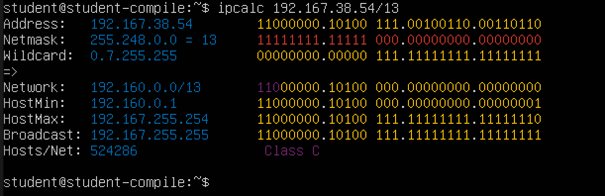
    `Адрес сети *192.167.38.54* - *192.160.0.0*`

 2) 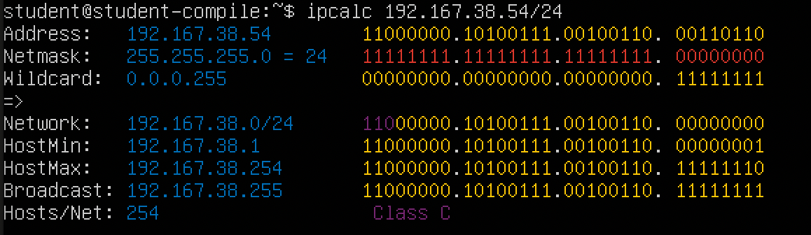
    `Перевод маски *255.255.255.0* в префискную и двоичную запись`
	- CIDR: /24
	- Mask: 255.255.255.0
	- Binary mask: 11111111.11111111.11111111.00000000
    
    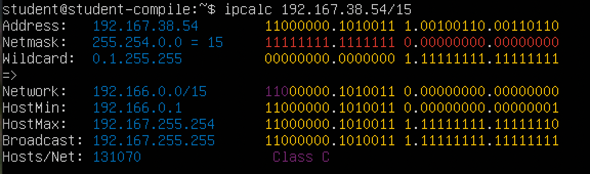
    `Перевод маски */15* в обычную и двоичную запись`
    - CIDR: /15
    - Mask: 255.254.0.0
    - Binary mask: 11111111.11111110.00000000.00000000
    
    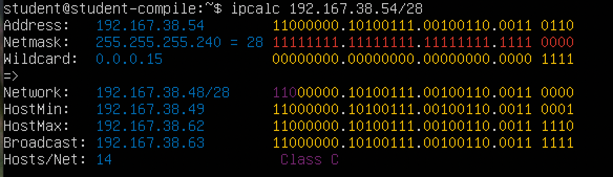
    `Перевод маски *11111111.11111111.11111111.11110000* в обычную и двоичную запись`
	- CIDR: /28
	- Mask: 255.255.255.240
	- Binary mask: 11111111.11111111.11111111.11110000

 3) 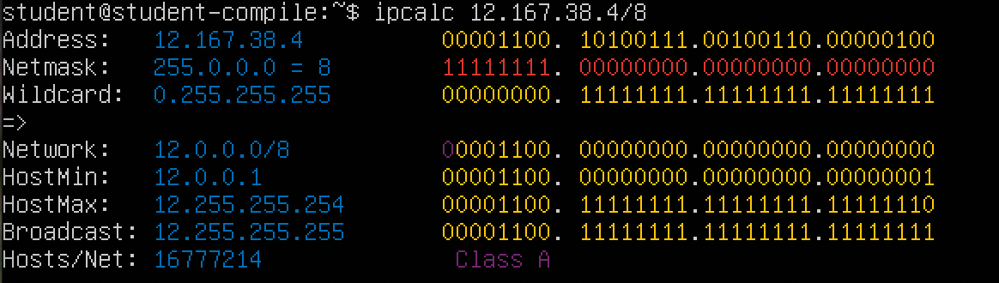
	` MIN host: *12.0.0.1* MAX host: *12.255.255.254*`

    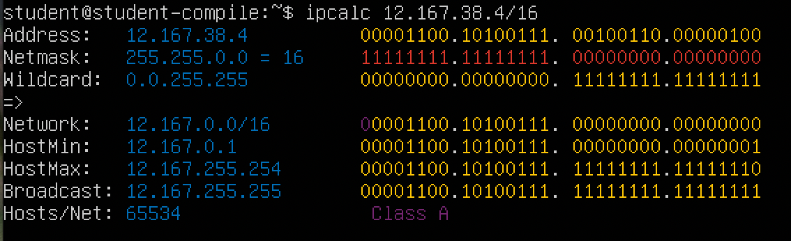
	` MIN host: *12.167.0.1* MAX host: *12.167.255.254*`

    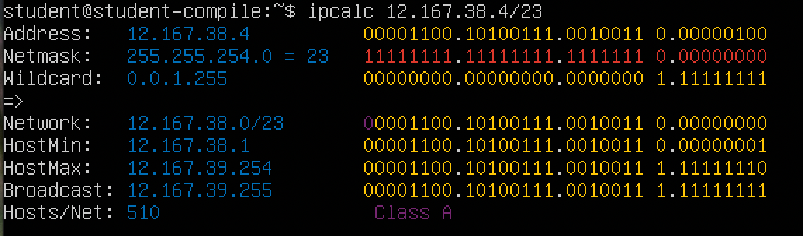
	` MIN host: *12.167.38.1* MAX host: *12.167.39.254*`

    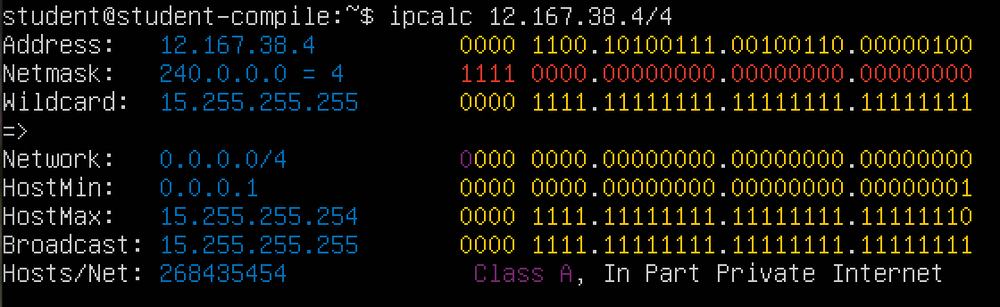
	` MIN host: *0.0.0.1* MAX host: *15.255.255.254*`

#### 1.2. localhost

Можно обратиться к приложению с IP: *127.0.0.2/24*, *127.1.0.1/8*

Нельзя обратиться к приложению с IP: *194.34.23.100*, *128.0.0.1*

#### 1.3. Диапазоны и сегменты сетей
##### 1) Какие из перечисленных IP можно использовать в качестве публичного, а какие только в качестве частных: *10.0.0.45/8*, *134.43.0.2/16*, *192.168.4.2/16*, *172.20.250.4/12*, *172.0.2.1/12*, *192.172.0.1/12*, *172.68.0.2/12*, *172.16.255.255/12*, *10.10.10.10/8*, *192.169.168.1/16*
	 частные:
	 10.0.0.45/8
	 192.168.4.2/16
	 172.20.250.4/12
	 172.16.255.255/12
	 10.10.10.10/8
	 
	 публичные:
	 134.43.0.2/16
	 172.0.2.1/12
	 192.172.0.1/12 (частично частный)
	 172.68.0.2/12
	 192.169.168.1/16

##### 2) какие из перечисленных IP адресов шлюза возможны у сети *10.10.0.0/18*: *10.0.0.1*, *10.10.0.2*, *10.10.10.10*, *10.10.100.1*, *10.10.1.255*
	 10.10.0.2
	 10.10.10.10
	 10.10.1.255

## Part 2. Статическая маршрутизация между двумя машинами

Смотрим существующие сетевые интерфейсы с помощью команды `ip a`:

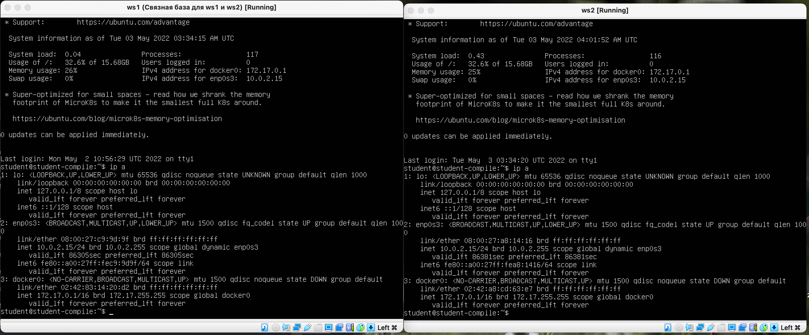

Вывод содержания измененного файла *etc/netplan/00-installer-config.yaml* для каждой машины и вызов команды `netplan apply` для перезапуска сервиса сети:

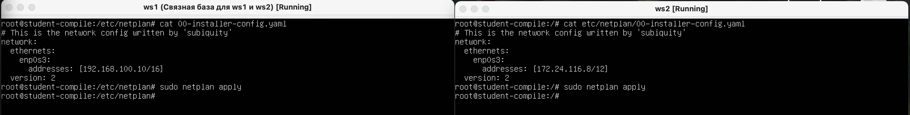

#### 2.1. Добавление статического маршрута вручную

Добавим статистический маршрут при помощи команды `ip r add` и пропингуем соединение между машинами:

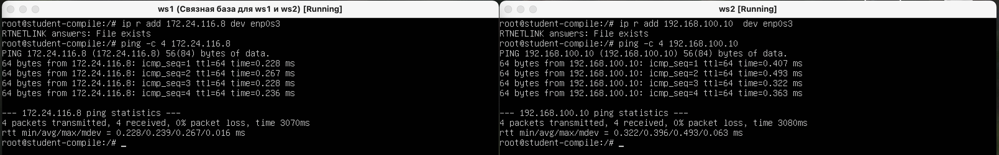

#### 2.2. Добавление статического маршрута с сохранением

Добавим статический маршрут от одной машины до другой с помощью файла *etc/netplan/00-installer-config.yaml*, перезапустим сервер сети и пропингуем соединение между машинами:

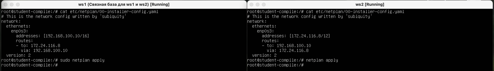

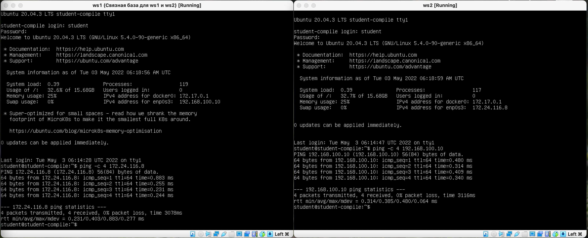

## Part 3. Утилита **iperf3**

#### 3.1. Скорость соединения
##### Перевести и записать в отчёт: 8 Mbps в MB/s, 100 MB/s в Kbps, 1 Gbps в Mbps

- 8 Mbps = 1 MB/s
- 100 MB/s = 819200 Kbps
- 1 Gbps = 1024 Mbps

#### 3.2. Утилита **iperf3**
##### Измерить скорость соединения между ws1 и ws2
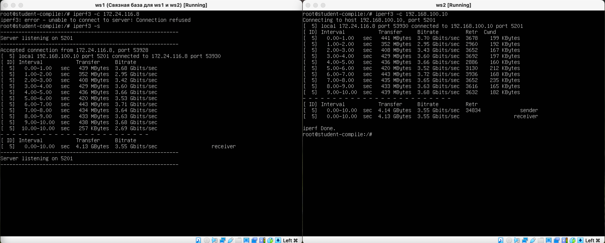

## Part 4. Сетевой экран

#### 4.1. Утилита **iptables**
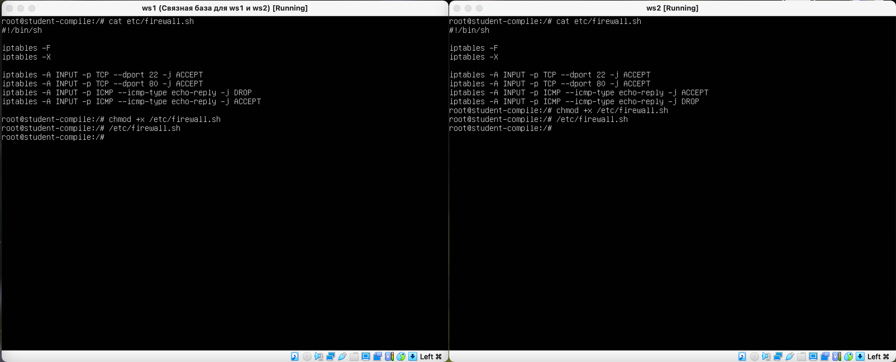

	Правила выполняться сверху-вниз, следовательно, если правило запрета находиться выше оно срабатывает, а правило разрешения находящиеся ниже нет.

#### 4.2. Утилита **nmap**
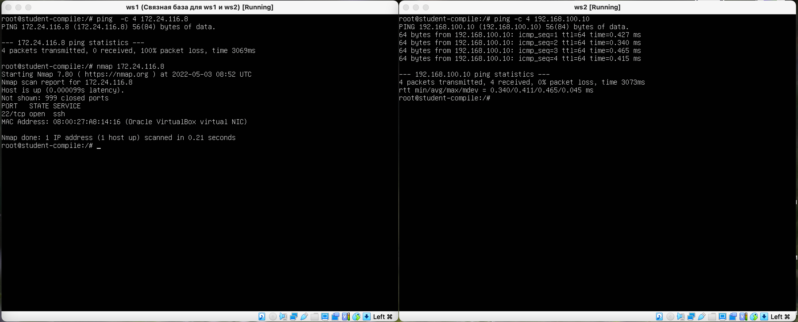
    
    Видно, что хост второй машины запущен, но не пингуется.

## Part 5. Статическая маршрутизация сети

Сеть:

#### 5.1. Настройка адресов машин

Содержание файла *etc/netplan/00-installer-config.yaml* для каждой машины:

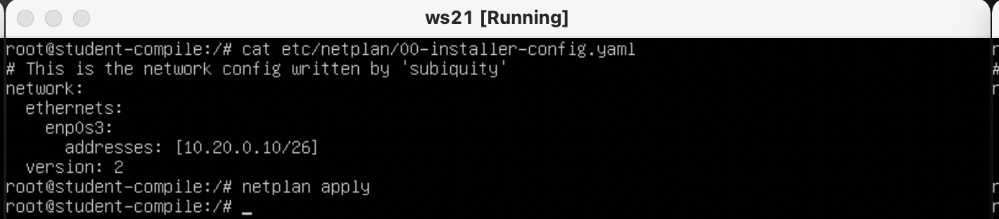

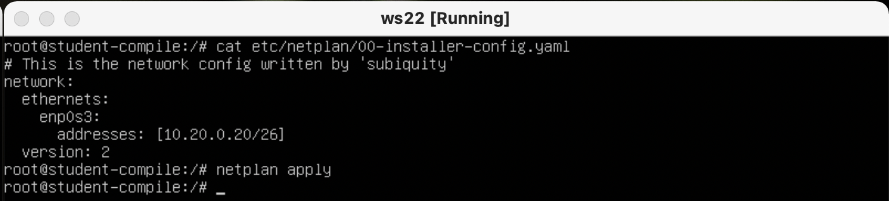

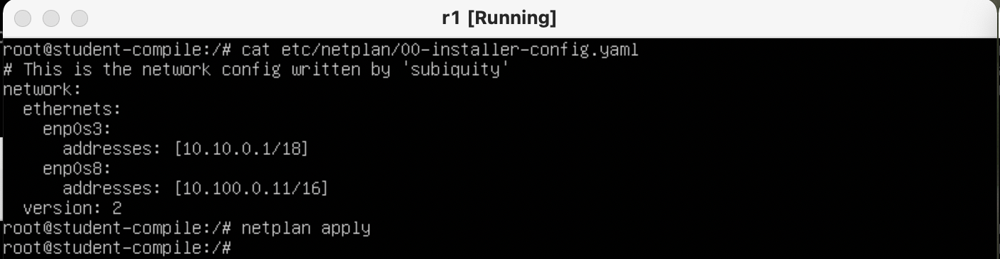

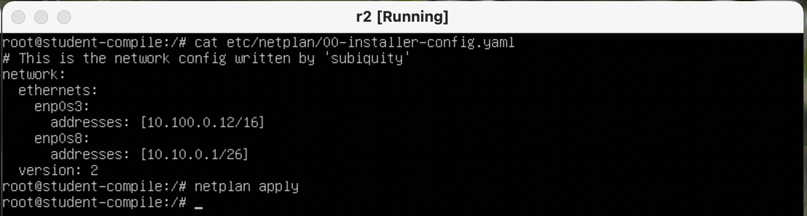

Перезапуск сервиса сети и проверка адреса машин (`ip -4 a`):

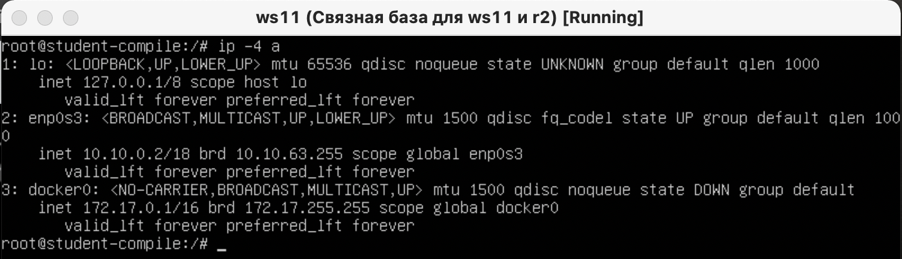

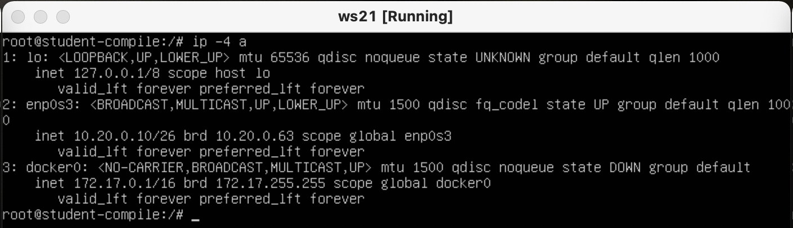

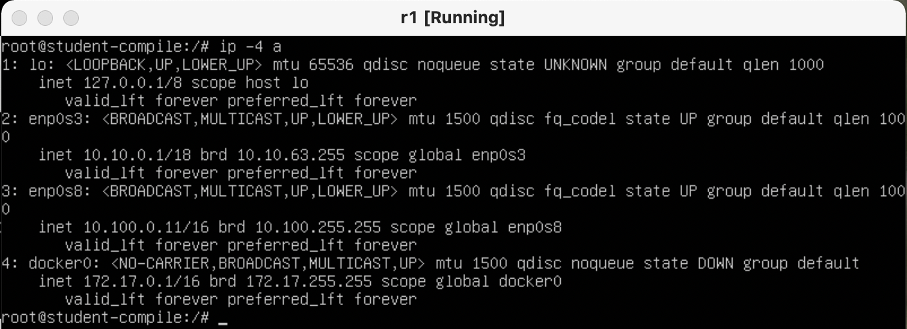

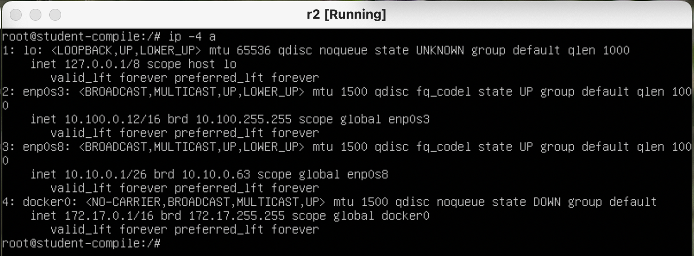

Пропингуем ws22 с ws21:

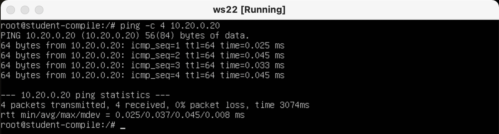

Пропингуем r1 с ws11:

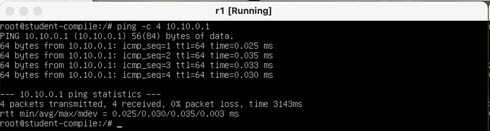

#### 5.2. Включение переадресации IP-адресов

Включение переадресации IP на роутерах с помощью команды `sysctl -w net.ipv4.ip_forward=1`:

Файл */etc/sysctl.conf* с добавленной строкой `net.ipv4.ip_forward = 1`:

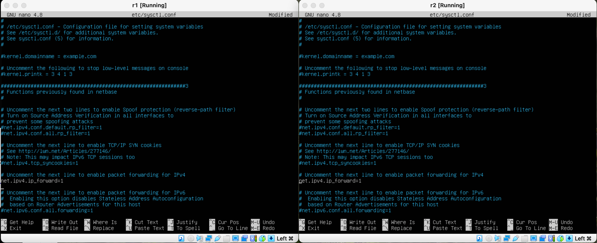

#### 5.3. Установка маршрута по умолчанию

Добавим gateway4 [ip роутера] в файлы конфигураций рабочих станций, перезапустим сервис сети и вызовем команду `ip r`:

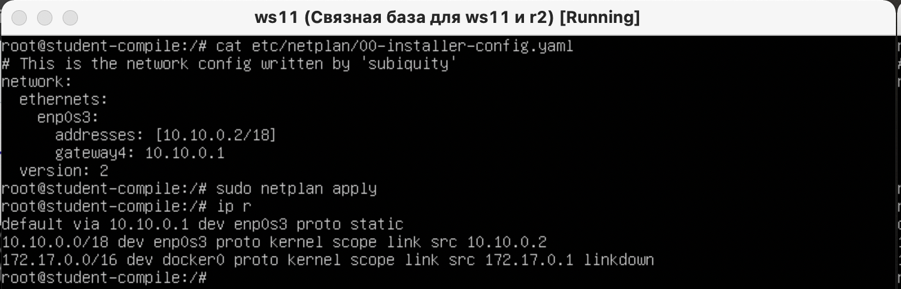

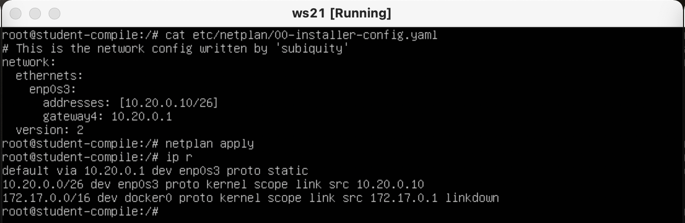

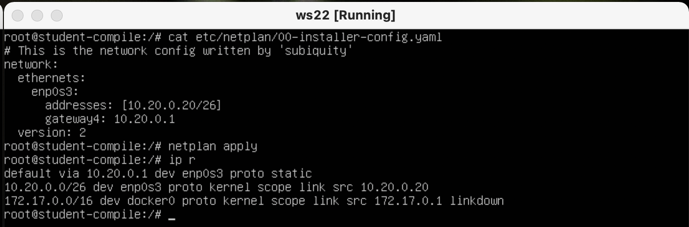

Пропингуем с ws11 роутер r2 и покажем на r2, что пинг доходит с помощью команды `tcpdump -tn -i eth1`:

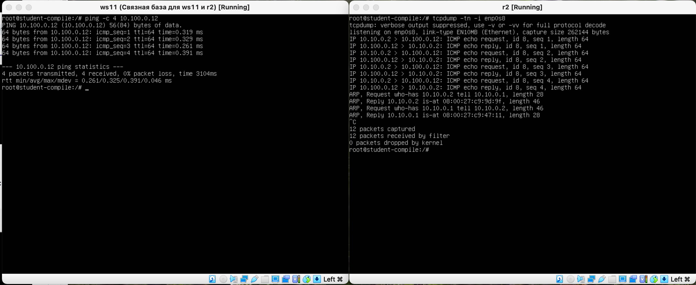

#### 5.4. Добавление статических маршрутов

Добавим в роутеры r1 и r2 статические маршруты в файле конфигураций, перезапустим сервис сети и вызовем команду `ip r`:

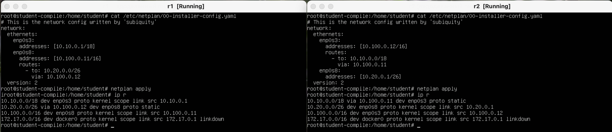

Вызов команд `ip r list 10.10.0.0/[маска сети]` и `ip r list 0.0.0.0/0` на ws11:

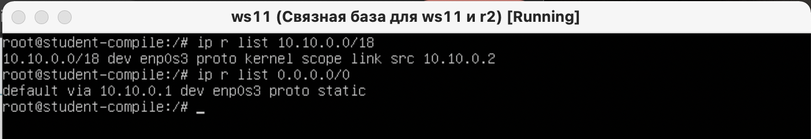

Для адреса 10.10.0.0/18 был выбран маршрут, отличный от 0.0.0.0/0, поскольку он является адресом сети и доступен без шлюза.

#### 5.5. Построение списка маршрутизаторов

Запуск на r1 команды дампа `tcpdump -tnv -i ent0` и построение списка маршрутизаторов на пути от ws11 до ws21 при помощи утилиты traceroute:

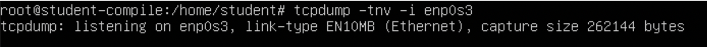

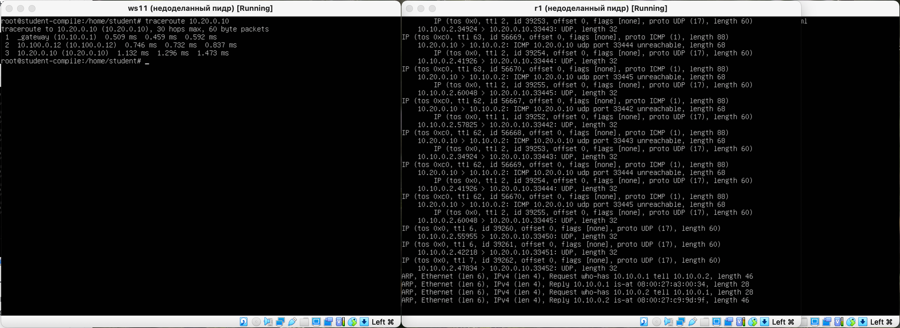

Для определения промежуточных маршрутизаторов traceroute отправляет целевому узлу серию ICMP-пакетов (по умолчанию 3 пакета), с каждым шагом увеличивая значение поля TTL («время жизни») на 1. Это поле обычно указывает максимальное количество маршрутизаторов, которое может быть пройдено пакетом. Первая серия пакетов отправляется с TTL, равным 1, и поэтому первый же маршрутизатор возвращает обратно ICMP-сообщение «time exceeded in transit», указывающее на невозможность доставки данных. Traceroute фиксирует адрес маршрутизатора, а также время между отправкой пакета и получением ответа (эти сведения выводятся на монитор компьютера). Затем traceroute повторяет отправку серии пакетов, но уже с TTL, равным 2, что заставляет первый маршрутизатор уменьшить TTL пакетов на единицу и направить их ко второму маршрутизатору. Второй маршрутизатор, получив пакеты с TTL=1, так же возвращает «time exceeded in transit».

Процесс повторяется до тех пор, пока пакет не достигнет целевого узла. При получении ответа от этого узла процесс трассировки считается завершённым.

На оконечном хосте IP-датаграмма с TTL = 1 не отбрасывается и не вызывает ICMP-сообщения типа срок истёк, а должна быть отдана приложению. Достижение пункта назначения определяется следующим образом: отсылаемые traceroute датаграммы содержат UDP-пакет с заведомо неиспользуемым номером порта на адресуемом хосте. Номер порта будет равен 33434 + (максимальное количество транзитных участков до узла) — 1. В пункте назначения UDP-модуль, получая подобные датаграммы, возвращает ICMP-сообщения об ошибке «порт недоступен». Таким образом, чтобы узнать о завершении работы, программе traceroute достаточно обнаружить, что поступило ICMP-сообщение об ошибке этого типа

#### 5.6. Использование протокола **ICMP** при маршрутизации

Запуск на r1 перехвата сетевого трафика, проходящего через eth0 с помощью команды `tcpdump -n -i eth0 icmp` и пинг с ws11 несуществующего IP `ping -c 1 10.30.0.111`:

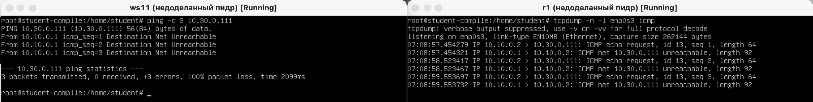

## Part 6. Динамическая настройка IP с помощью **DHCP**

1. Содержание файла */etc/dhcp/dhcpd.conf* для r2 с конфигурацией службы **DHCP**:

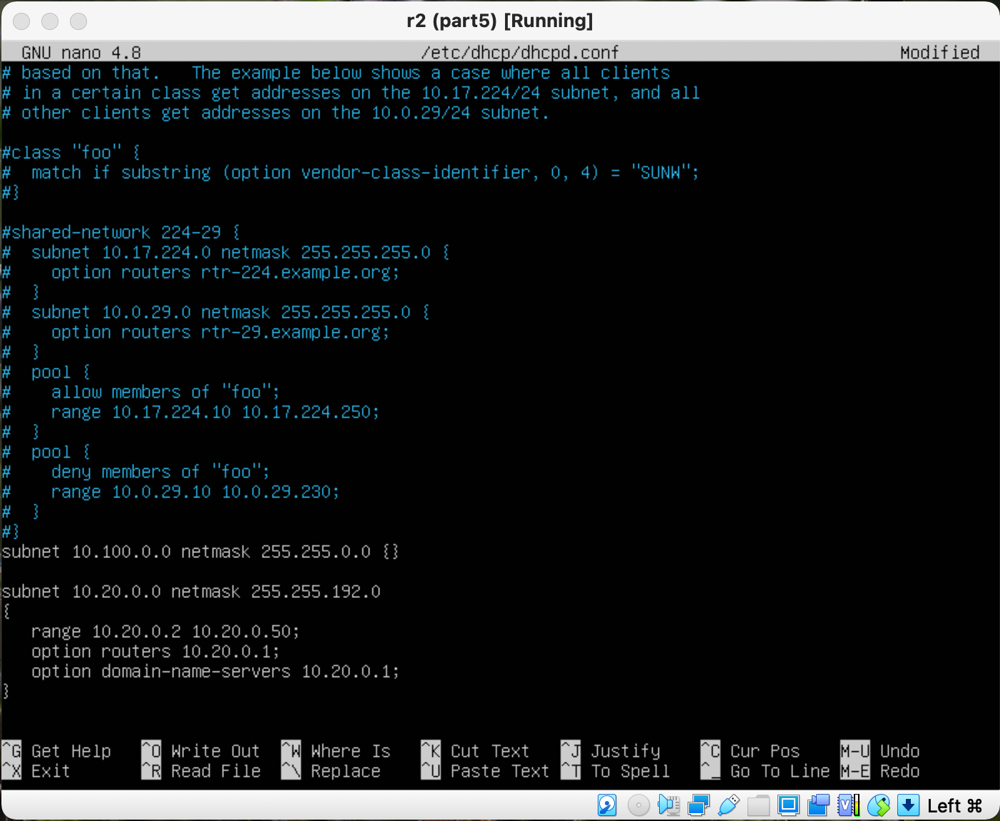

Содержание файла *resolv.conf* с `nameserver 8.8.8.8.`:

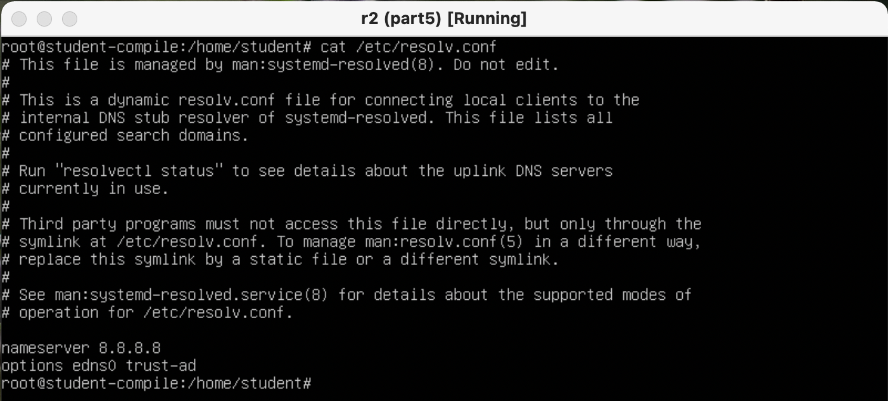

2. Перезагрузка службы **DHCP** командой `systemctl restart isc-dhcp-server`:

Перезагружаем машину ws21 при помощи `reboot` и через `ip a` покажем, что она получила адрес:

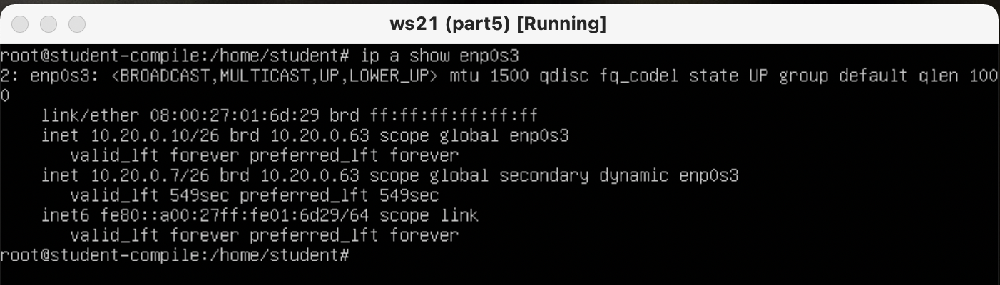

Пинг ws22 с ws21:

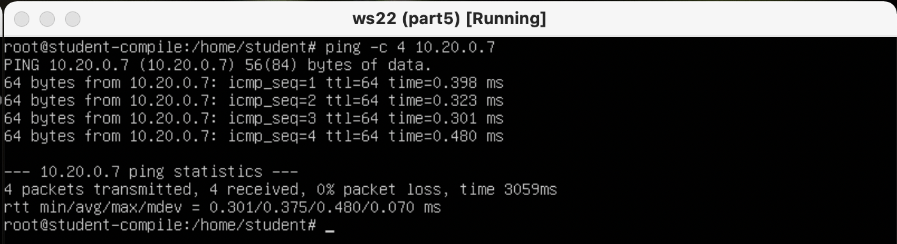

3. Cодержание файла *etc/netplan/00-installer-config.yaml* для ws11 с добавленным MAC адресом:

4. Аналогичная настройка r1 (с жесткой привязкой к MAC адресу)

Конфигурация DHCP:

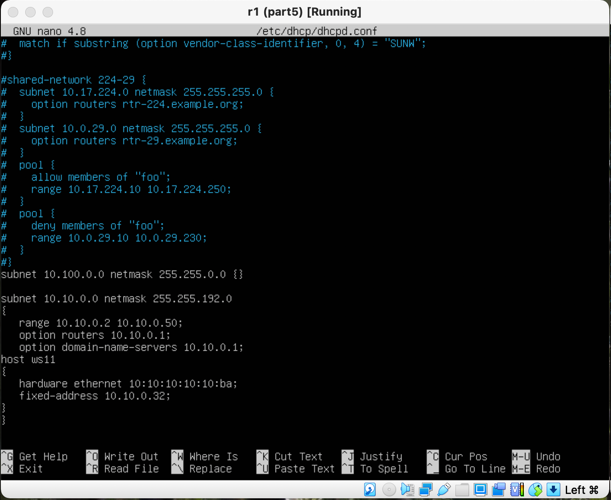

DNS:

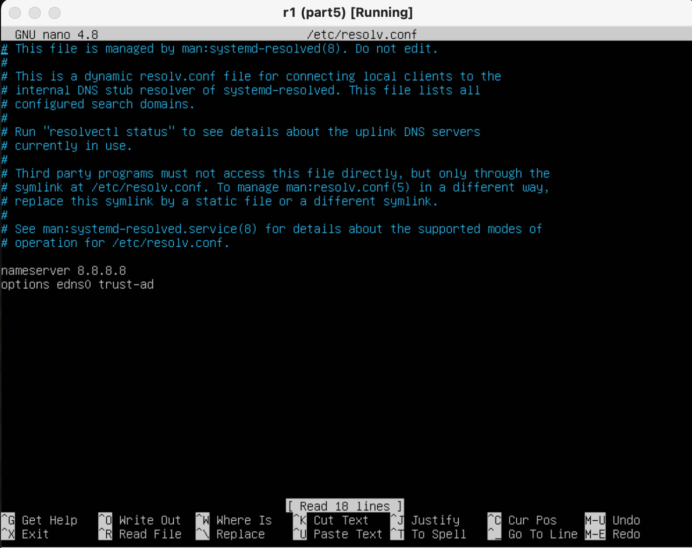

Перезагрузка службы DHCP:

5. Запрос обновления ip адреса с ws21

ip до обновления:

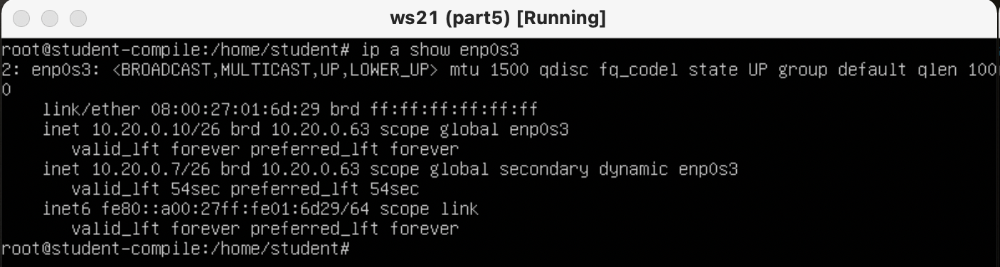

ip после обновления:

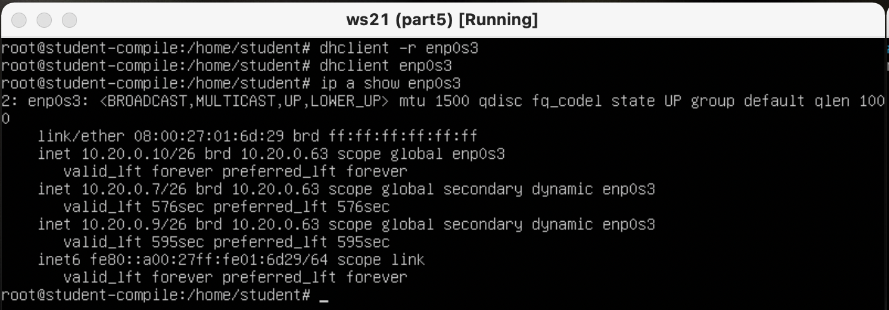

Команда `sudo dhclient -r enp0s3` освобождает текущий адрес интерфейса enp0s3.
Команда `sudo dhclient enp0s3` задает новый адрес указанному интерфейсу.

## Part 7. **NAT**
1. Содержание файла */etc/apache2/ports.conf* на ws22 и r2 (строка `Listen 80` изменена на `Listen 0.0.0.0:80`):

2. Запуск веб-сервера Apache командой `service apache2 start` на ws22 и r1:

3. Добавление в фаервол на r2 следующих правил:
1) Удаление правил в таблице filter - `iptables -F`
2) Удаление правил в таблице "NAT" - `iptables -F -t nat`
3) Отбрасывать все маршрутизируемые пакеты - `iptables --policy FORWARD DROP`

Добавление правил и запуск фаервола:

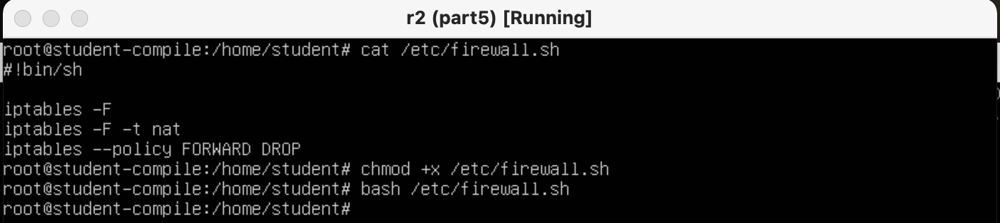

Проверка соединения между ws22 и r1 командой ping:

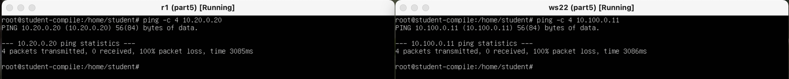

4) Разрешим маршрутизацию всех пакетов протокола **ICMP**:

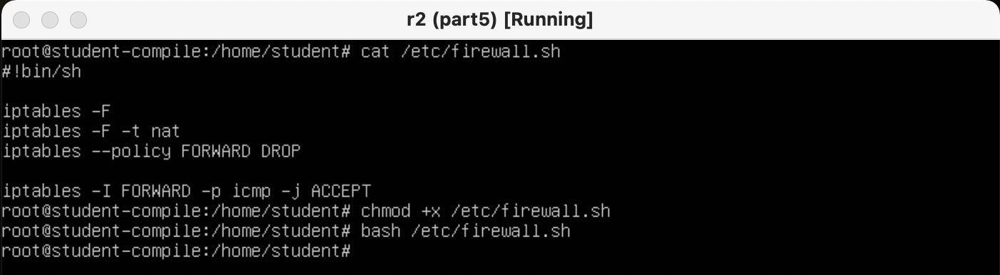

Проверка соединения между ws22 и r1 командой ping:

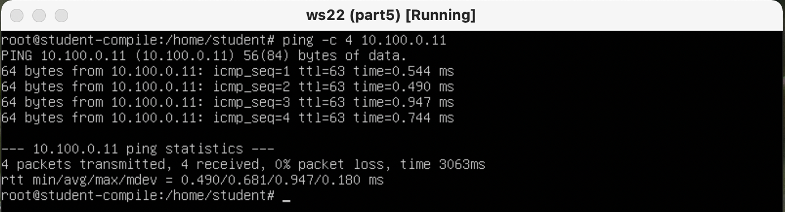

5) Включить **SNAT**, а именно маскирование всех локальных ip из локальной сети, находящейся за r2 (сеть 10.20.0.0)

6) Включить **DNAT** на 8080 порт машины r2 и добавить к веб-серверу Apache, запущенному на ws22, доступ извне сети

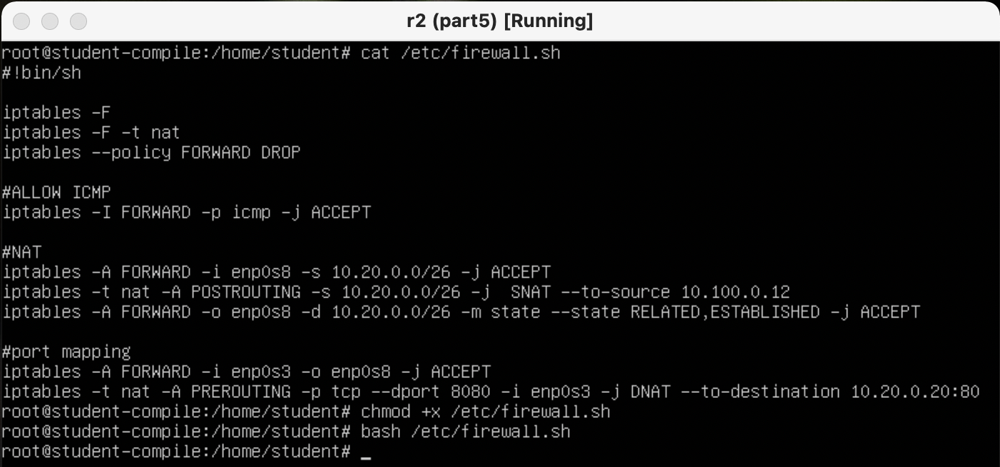

Проверка соединения по TCP для **SNAT**, для этого с ws22 подключиться к серверу Apache на r1 командой `telnet [адрес] [порт]`:

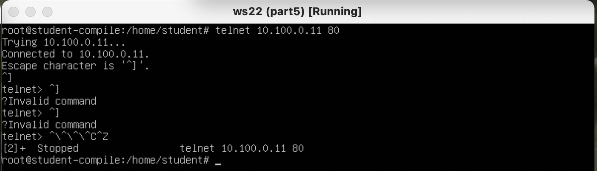

Проверка соединения по TCP для **DNAT**, для этого с r1 подключиться к серверу Apache на ws22 командой `telnet` (обращаться по адресу r2 и порту 8080):

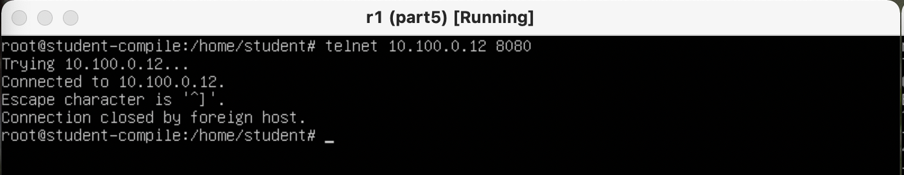

## Part 8. Дополнительно. Знакомство с **SSH Tunnels**

1. Запуск веб-сервера **Apache** на ws22 только на localhost:

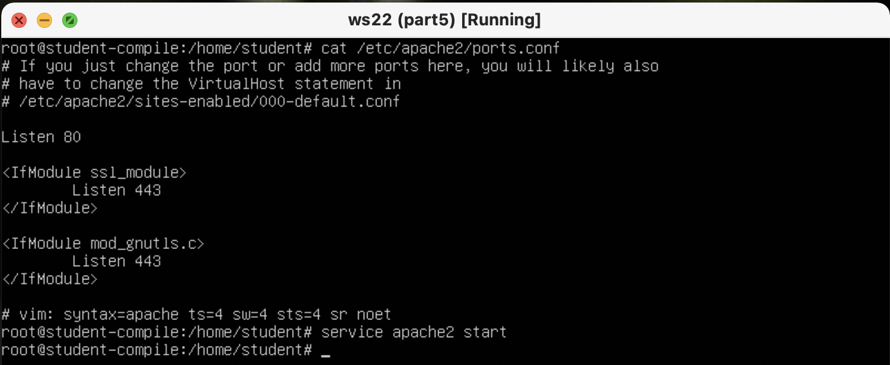

2. Воспользоваться *Local TCP forwarding* с ws21 до ws22, чтобы получить доступ к веб-серверу на ws22 с ws21:

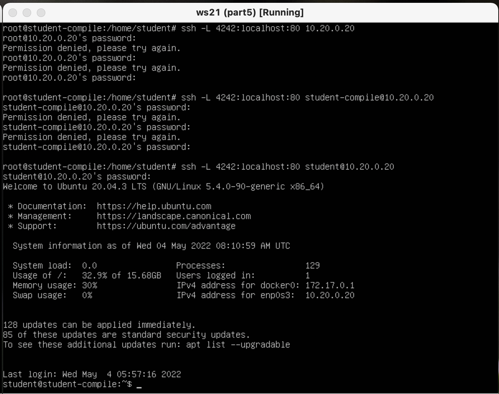

Для *Local TCP forwarding* применяется команда ssh -L local_port:destination:destination_port ssh_server_ip

Проверка подключения:

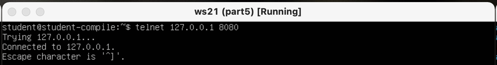

3. Воспользоваться *Remote TCP forwarding* c ws11 до ws22, чтобы получить доступ к веб-серверу на ws22 с ws11:

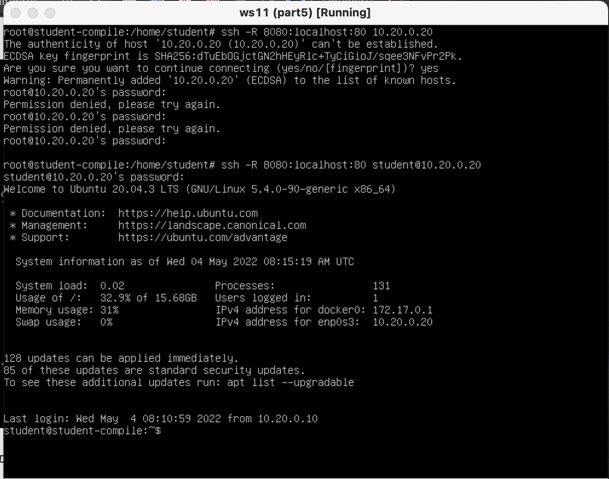

Для *Remote TCP forwarding* применяется команда ssh -R remote_port:destination:destination_port ssh_server_ip

Проверка подключения:

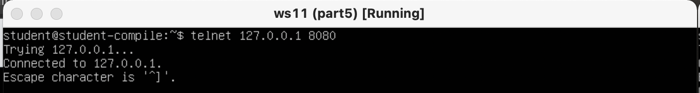

